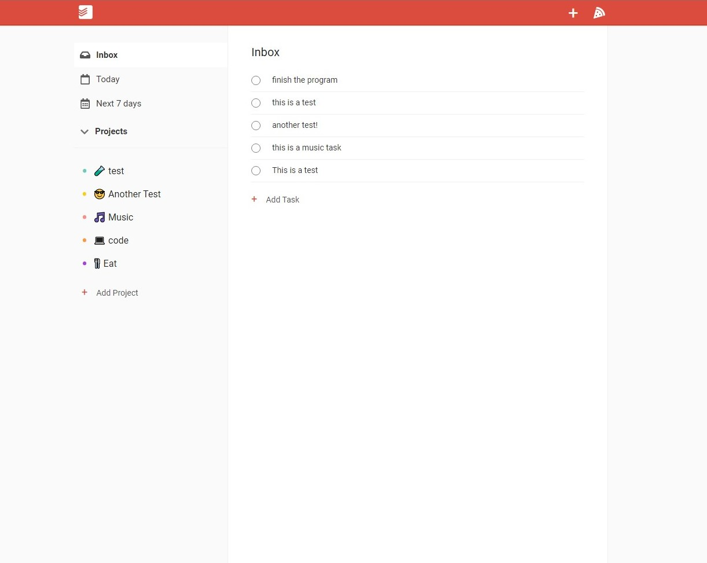

# Clone Todoist
Clone app using ReactJs and Firebase!.

## How to use
In `src/firebase.js` paste the *firebaseConfig* and it's ready to use.

## Available Scripts
the project directory, you can run:

```
npm start

npm test

npm run build
```

## Screenshot

This project was created by [F34th3r.io](https://F34th3r.io).